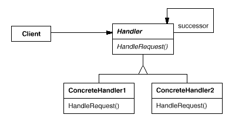
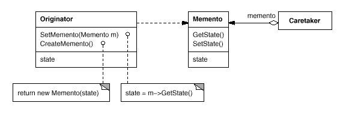
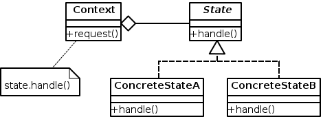

# Поведенчески шаблони за дизайн

## Верига на отговорност

### Клас диаграма:



### Приложимост:

Използвайте шаблона верига на отговорност, когато:

  * повече от един обект може да обработи дадена заявка и не е предварително известно кой точно обект трябва да обработи заявката;
  * искате да подадете заявка към един от няколко обекта без да уточнявате получателя изрично;
  * множеството от обекти, които могат да обработват заявки, трябва да се променя динамично.

### Примерен код:

```cs

using System;
 
namespace Chain
{
  /// <summary>
  /// MainApp startup class for
  /// Chain of Responsibility Design Pattern.
  /// </summary>
  class MainApp
  {
    /// <summary>
    /// Entry point into console application.
    /// </summary>
    static void Main()
    {
      // Setup Chain of Responsibility
      Approver larry = new Director();
      Approver sam = new VicePresident();
      Approver tammy = new President();
 
      larry.SetSuccessor(sam);
      sam.SetSuccessor(tammy);
 
      // Generate and process purchase requests
      Purchase p = new Purchase(2034, 350.00, "Assets");
      larry.ProcessRequest(p);
 
      p = new Purchase(2035, 32590.10, "Project X");
      larry.ProcessRequest(p);
 
      p = new Purchase(2036, 122100.00, "Project Y");
      larry.ProcessRequest(p);
 
      // Wait for user
      Console.ReadKey();
    }
  }
 
  /// <summary>
  /// The 'Handler' abstract class
  /// </summary>
  abstract class Approver
  {
    protected Approver successor;
 
    public void SetSuccessor(Approver successor)
    {
      this.successor = successor;
    }
 
    public abstract void ProcessRequest(Purchase purchase);
  }
 
  /// <summary>
  /// The 'ConcreteHandler' class
  /// </summary>
  class Director : Approver
  {
    public override void ProcessRequest(Purchase purchase)
    {
      if (purchase.Amount < 10000.0)
      {
        Console.WriteLine("{0} approved request# {1}",
          this.GetType().Name, purchase.Number);
      }
      else if (successor != null)
      {
        successor.ProcessRequest(purchase);
      }
    }
  }
 
  /// <summary>
  /// The 'ConcreteHandler' class
  /// </summary>
  class VicePresident : Approver
  {
    public override void ProcessRequest(Purchase purchase)
    {
      if (purchase.Amount < 25000.0)
      {
        Console.WriteLine("{0} approved request# {1}",
          this.GetType().Name, purchase.Number);
      }
      else if (successor != null)
      {
        successor.ProcessRequest(purchase);
      }
    }
  }
 
  /// <summary>
  /// The 'ConcreteHandler' class
  /// </summary>
  class President : Approver
  {
    public override void ProcessRequest(Purchase purchase)
    {
      if (purchase.Amount < 100000.0)
      {
        Console.WriteLine("{0} approved request# {1}",
          this.GetType().Name, purchase.Number);
      }
      else
      {
        Console.WriteLine(
          "Request# {0} requires an executive meeting!",
          purchase.Number);
      }
    }
  }
 
  /// <summary>
  /// Class holding request details
  /// </summary>
  class Purchase
  {
    private int _number;
    private double _amount;
    private string _purpose;
 
    // Constructor
    public Purchase(int number, double amount, string purpose)
    {
      this._number = number;
      this._amount = amount;
      this._purpose = purpose;
    }
 
    // Gets or sets purchase number
    public int Number
    {
      get { return _number; }
      set { _number = value; }
    }
 
    // Gets or sets purchase amount
    public double Amount
    {
      get { return _amount; }
      set { _amount = value; }
    }
 
    // Gets or sets purchase purpose
    public string Purpose
    {
      get { return _purpose; }
      set { _purpose = value; }
    }
  }
}

```

## Стратегия

### Клас диаграма:


### Приложимост:

Използвайте шаблона стратегия, когато:

  * много свързани класове се различават само по тяхното поведение. Стратегиите са начин да се конфигурира клас с едно от многото поведения.
  * се нуждаете от различни варианти на алгоритъм.
  * алгоритъм използва данни, за които клиента не трябва да знае.

### Примерен код:

```cs

namespace IVSR.Designpattern.Strategy {
    //The interface for the strategies
    public interface ICalculate {
       int Calculate(int value1, int value2);
    }

    //strategies
    //Strategy 1: Minus
    class Minus : ICalculate {
        public int Calculate(int value1, int value2) {
            return value1 - value2;
        }
    }

    //Strategy 2: Plus
    class Plus : ICalculate {
        public int Calculate(int value1, int value2) {
            return value1 + value2;
        }
    }

    //The client
    class CalculateClient {
        private ICalculate calculateStrategy;

        //Constructor: assigns strategy to interface
        public CalculateClient(ICalculate strategy) {
            this.calculateStrategy = strategy;
        }

        //Executes the strategy
        public int Calculate(int value1, int value2) {
            return calculateStrategy.Calculate(value1, value2);
        }
    }

    //Initialize
    protected void Page_Load(object sender, EventArgs e) {
        CalculateClient minusClient = new CalculateClient(new Minus());
        Response.Write("<br />Minus: " + minusClient.Calculate(7, 1).ToString());

        CalculateClient plusClient = new CalculateClient(new Plus());
        Response.Write("<br />Plus: " + plusClient.Calculate(7, 1).ToString());
    }
}

```

## Спомен

### Клас диаграма:



### Приложимост:

Използвайте шаблонa спомен, когато:
  * моментното състояние на обект трябва да се съхрни, така че да може да се възстанови на по-късен етап и;
  * директен интерфейс за получаване на състоянието би изложил имплементационни детайли и би счупил енкапсулацията на обекта.

### Примерен код:

```cs

    //original object
    public class OriginalObject
    {
        public string String1 { get; set; }
        public string String2 { get; set; }
        public Memento MyMemento { get; set; }

        public OriginalObject(string str1, string str2)
        {
            this.String1 = str1;
            this.String2 = str2;
            this.MyMemento = new Memento(str1, str2);
        }
        public void Revert()
        {
            this.String1 = this.MyMemento.string1;
            this.String2 = this.MyMemento.string2;
        }
    }
    
    //Memento object
    public class Memento
    {
        public readonly string string1;
        public readonly string string2;

        public Memento(string str1, string str2)
        {
            string1 = str1;
            string2 = str2;
        }
    }

```

## Състояние

### Клас диаграма:



### Приложимост:

Използвайте шаблона състояние в някой от следните случаи:

  * поведението на обекта зависи от неговото състояние и трябва да си променя поведението по време на изпълнение в зависимост от състоянието.
  * Операциите имат огромни многосъставни условни твърдения, които зависят от състоянието на обекта. Това състояние обикновено се представя с една или повече изброени константи. Често няколко операции съдържат едни и същи условни структори. Шаблонът състояние слага всеки един клон от условната структора в отделен клас. Това позволява състоянието на обекта да се третира като отделен обект независимо от другите обекти.

### Примерен код:

```cs

using System;
 
namespace State
{
  /// <summary>
  /// MainApp startup class for
  /// State Design Pattern.
  /// </summary>
  class MainApp
  {
    /// <summary>
    /// Entry point into console application.
    /// </summary>
    static void Main()
    {
      // Open a new account
      Account account = new Account("Jim Johnson");
 
      // Apply financial transactions
      account.Deposit(500.0);
      account.Deposit(300.0);
      account.Deposit(550.0);
      account.PayInterest();
      account.Withdraw(2000.00);
      account.Withdraw(1100.00);
 
      // Wait for user
      Console.ReadKey();
    }
  }
 
  /// <summary>
  /// The 'State' abstract class
  /// </summary>
  abstract class State
  {
    protected Account account;
    protected double balance;
 
    protected double interest;
    protected double lowerLimit;
    protected double upperLimit;
 
    // Properties
    public Account Account
    {
      get { return account; }
      set { account = value; }
    }
 
    public double Balance
    {
      get { return balance; }
      set { balance = value; }
    }
 
    public abstract void Deposit(double amount);
    public abstract void Withdraw(double amount);
    public abstract void PayInterest();
  }
 
 
  /// <summary>
  /// A 'ConcreteState' class
  /// <remarks>
  /// Red indicates that account is overdrawn 
  /// </remarks>
  /// </summary>
  class RedState : State
  {
    private double _serviceFee;
 
    // Constructor
    public RedState(State state)
    {
      this.balance = state.Balance;
      this.account = state.Account;
      Initialize();
    }
 
    private void Initialize()
    {
      // Should come from a datasource
      interest = 0.0;
      lowerLimit = -100.0;
      upperLimit = 0.0;
      _serviceFee = 15.00;
    }
 
    public override void Deposit(double amount)
    {
      balance += amount;
      StateChangeCheck();
    }
 
    public override void Withdraw(double amount)
    {
      amount = amount - _serviceFee;
      Console.WriteLine("No funds available for withdrawal!");
    }
 
    public override void PayInterest()
    {
      // No interest is paid
    }
 
    private void StateChangeCheck()
    {
      if (balance > upperLimit)
      {
        account.State = new SilverState(this);
      }
    }
  }
 
  /// <summary>
  /// A 'ConcreteState' class
  /// <remarks>
  /// Silver indicates a non-interest bearing state
  /// </remarks>
  /// </summary>
  class SilverState : State
  {
    // Overloaded constructors
 
    public SilverState(State state) :
      this(state.Balance, state.Account)
    {
    }
 
    public SilverState(double balance, Account account)
    {
      this.balance = balance;
      this.account = account;
      Initialize();
    }
 
    private void Initialize()
    {
      // Should come from a datasource
      interest = 0.0;
      lowerLimit = 0.0;
      upperLimit = 1000.0;
    }
 
    public override void Deposit(double amount)
    {
      balance += amount;
      StateChangeCheck();
    }
 
    public override void Withdraw(double amount)
    {
      balance -= amount;
      StateChangeCheck();
    }
 
    public override void PayInterest()
    {
      balance += interest * balance;
      StateChangeCheck();
    }
 
    private void StateChangeCheck()
    {
      if (balance < lowerLimit)
      {
        account.State = new RedState(this);
      }
      else if (balance > upperLimit)
      {
        account.State = new GoldState(this);
      }
    }
  }
 
  /// <summary>
  /// A 'ConcreteState' class
  /// <remarks>
  /// Gold indicates an interest bearing state
  /// </remarks>
  /// </summary>
  class GoldState : State
  {
    // Overloaded constructors
    public GoldState(State state)
      : this(state.Balance, state.Account)
    {
    }
 
    public GoldState(double balance, Account account)
    {
      this.balance = balance;
      this.account = account;
      Initialize();
    }
 
    private void Initialize()
    {
      // Should come from a database
      interest = 0.05;
      lowerLimit = 1000.0;
      upperLimit = 10000000.0;
    }
 
    public override void Deposit(double amount)
    {
      balance += amount;
      StateChangeCheck();
    }
 
    public override void Withdraw(double amount)
    {
      balance -= amount;
      StateChangeCheck();
    }
 
    public override void PayInterest()
    {
      balance += interest * balance;
      StateChangeCheck();
    }
 
    private void StateChangeCheck()
    {
      if (balance < 0.0)
      {
        account.State = new RedState(this);
      }
      else if (balance < lowerLimit)
      {
        account.State = new SilverState(this);
      }
    }
  }
 
  /// <summary>
  /// The 'Context' class
  /// </summary>
  class Account
  {
    private State _state;
    private string _owner;
 
    // Constructor
    public Account(string owner)
    {
      // New accounts are 'Silver' by default
      this._owner = owner;
      this._state = new SilverState(0.0, this);
    }
 
    // Properties
    public double Balance
    {
      get { return _state.Balance; }
    }
 
    public State State
    {
      get { return _state; }
      set { _state = value; }
    }
 
    public void Deposit(double amount)
    {
      _state.Deposit(amount);
      Console.WriteLine("Deposited {0:C} --- ", amount);
      Console.WriteLine(" Balance = {0:C}", this.Balance);
      Console.WriteLine(" Status = {0}",
        this.State.GetType().Name);
      Console.WriteLine("");
    }
 
    public void Withdraw(double amount)
    {
      _state.Withdraw(amount);
      Console.WriteLine("Withdrew {0:C} --- ", amount);
      Console.WriteLine(" Balance = {0:C}", this.Balance);
      Console.WriteLine(" Status = {0}\n",
        this.State.GetType().Name);
    }
 
    public void PayInterest()
    {
      _state.PayInterest();
      Console.WriteLine("Interest Paid --- ");
      Console.WriteLine(" Balance = {0:C}", this.Balance);
      Console.WriteLine(" Status = {0}\n",
        this.State.GetType().Name);
    }
  }
}

```