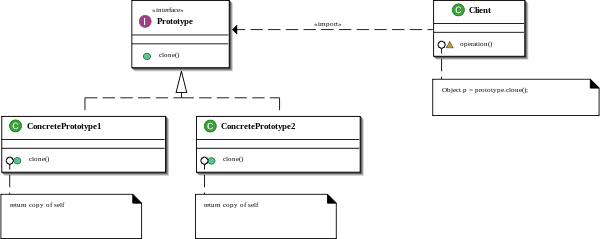

# Създаващи шаблони за дизайн

## Прототипен шаблон

### Клас диаграма:



### Приложимост:

* Прототипният шаблон се използва, когато искаме клиента да не зависи от това как се създават обектите, как са композирани и как са представени.
* Прототипният шаблон се използва и когато:
  * конкретните инстанции се определят по време на изпълнение на програмата;
  * искаме да избегнем създаването от паралена йерархия от фабрики за създаване на класовете;
  * инстанциите могат да имат само едно от няколко състояния.

### Примерен код:

```cs
public abstract class Prototype
{
    // normal implementation
    public abstract Prototype Clone();
}

public class ConcretePrototype1 : Prototype
{
    public override Prototype Clone()
    {
        return (Prototype)this.MemberwiseClone(); // Clones the concrete class.
    }
}

public class ConcretePrototype2 : Prototype
{
    public override Prototype Clone()
    {
        return (Prototype)this.MemberwiseClone(); // Clones the concrete class.
    }
}
```

## Фабричен метод

### Клас диаграма:


### Определение:

Дефинира интерфейс за създаване на обект, но оставя наследниците на интерфейса да решават, кой клас да инстанцират.

### Примерен код:

```cs
public interface IPeople
{
    string GetName();
}

public class Villagers : IPeople
{
    #region IPeople Members

    public string GetName()
    {
        return "Village Guy";
    }

    #endregion
}

public class CityPeople : IPeople
{
    #region IPeople Members

    public string GetName()
    {
        return "City Guy";
    }

    #endregion
}

public enum PeopleType
{
    RURAL,
    URBAN
}

/// <summary>
/// Implementation of Factory - Used to create objects
/// </summary>
public class Factory
{
    public IPeople GetPeople(PeopleType type)
    {
        IPeople people = null;
        switch (type)
        {
            case PeopleType.RURAL :
                people = new Villagers();
                break;
            case PeopleType.URBAN:
                people = new CityPeople();
                break;
            default:
                break;
        }
        return people;
    }
}
```