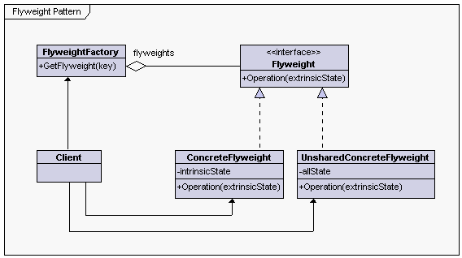

# Структурни шаблони за дизайн

## Съставящ шаблон

### Клас диаграма:


### Приложимост:

Съставящият шаблон се изполозва, когато:
  * искаме да представяме части от или цели йерархии от обекти;
  * искаме клиентите на кода да могат да игнорират различието между отделните обекти и композицията от обекти.

### Примерен код:

```cs
namespace CompositePattern
{
    using System;
    using System.Collections.Generic;
    using System.Linq;
    //Client
    class Program
    {
        static void Main(string[] args)
        {
            // initialize variables
            var compositeGraphic = new CompositeGraphic();
            var compositeGraphic1 = new CompositeGraphic();
            var compositeGraphic2 = new CompositeGraphic();

            //Add 1 Graphic to compositeGraphic1
            compositeGraphic1.Add(new Ellipse());

            //Add 2 Graphic to compositeGraphic2
            compositeGraphic2.AddRange(new Ellipse(), 
                new Ellipse());

            /*Add 1 Graphic, compositeGraphic1, and 
              compositeGraphic2 to compositeGraphic */
            compositeGraphic.AddRange(new Ellipse(), 
                compositeGraphic1, 
                compositeGraphic2);

            /*Prints the complete graphic 
            (four times the string "Ellipse").*/
            compositeGraphic.Print();
            Console.ReadLine();
        }
    }

    //Component
    public interface IGraphic
    {
        void Print();
    }

    //Leaf
    public class Ellipse : IGraphic
    {
        //Prints the graphic
    	public void Print()
        {
            Console.WriteLine("Ellipse");
        }
    }

    //Composite
    public class CompositeGraphic : IGraphic
    {
        //Collection of Graphics.
        private readonly List<IGraphic> graphics;

        //Constructor 
        public CompositeGraphic()
        {
            //initialize generic Collection(Composition)
            graphics = new List<IGraphic>();
        }

        //Adds the graphic to the composition
        public void Add(IGraphic graphic)
        {
            graphics.Add(graphic);
        }

        //Adds multiple graphics to the composition
        public void AddRange(params IGraphic[] graphic)
        {
            graphics.AddRange(graphic);
        }

        //Removes the graphic from the composition
        public void Delete(IGraphic graphic)
        {
            graphics.Remove(graphic);
        }

        //Prints the graphic.
        public void Print()
        {
            foreach (var childGraphic in graphics)
            {
                childGraphic.Print();
            }
        }
    }
}
```

## Шаблон категория "Муха"

### Клас диаграма:



### Приложимост:

Ефективността на този модел зависи в голяма степен от това как и къде се използва. Използвай те то, когато всички от изброените са верни:
  * приложението използва голям брой обекти;
  * използва се много памет заради големия брой обекти;
  * по-голямата част от състоянието на обекта може да се направи външно;
  * много групи от обекти могат да бъдат заменени с относително малко споделени обекти, след като им се отстрани външното състояние;
  * приложението не зависи от самоличността на обектите. След като обектите могат да бъдат споделени, тестове за самоличност ще са верни за концептуално различни обекти.

### Примерен код:

```cs
using System.Collections.Concurrent;
using System.Collections.Generic;
using System.Threading;

public interface ICoffeeFlavourFactory {
    CoffeeFlavour GetFlavour(string flavour);
}

public class ReducedMemoryFootprint : ICoffeeFlavourFactory {
    private readonly object _cacheLock = new object();
    private readonly IDictionary<string, CoffeeFlavour> _cache = new Dictionary<string, CoffeeFlavour>();

    public CoffeeFlavour GetFlavour(string flavour) {
        if (_cache.ContainsKey(flavour)) return _cache[flavour];
        var coffeeFlavour = new CoffeeFlavour(flavour);
        ThreadPool.QueueUserWorkItem(AddFlavourToCache, coffeeFlavour);
        return coffeeFlavour;
    }

    private void AddFlavourToCache(object state) {
        var coffeeFlavour = (CoffeeFlavour)state;
        if (!_cache.ContainsKey(coffeeFlavour.Flavour)) {
            lock (_cacheLock) {
                if (!_cache.ContainsKey(coffeeFlavour.Flavour)) _cache.Add(coffeeFlavour.Flavour, coffeeFlavour);
            }
        }
    }
}

public class MinimumMemoryFootprint : ICoffeeFlavourFactory {
    private readonly ConcurrentDictionary<string, CoffeeFlavour> _cache = new ConcurrentDictionary<string, CoffeeFlavour>();

    public CoffeeFlavour GetFlavour(string flavour) {
        return _cache.GetOrAdd(flavour, flv => new CoffeeFlavour(flv));
    }
}

public class CoffeeFlavour {
    private readonly string _flavour;

    public CoffeeFlavour(string flavour) {
        _flavour = flavour;
    }

    public string Flavour {
        get { return _flavour; }
    }

    public override bool Equals(object obj) {
        if (ReferenceEquals(null, obj)) return false;
        return obj is CoffeeFlavour && Equals((CoffeeFlavour)obj);
    }

    public bool Equals(CoffeeFlavour other) {
        return string.Equals(_flavour, other._flavour);
    }

    public override int GetHashCode() {
        return (_flavour != null ? _flavour.GetHashCode() : 0);
    }

    public static bool operator ==(CoffeeFlavour a, CoffeeFlavour b) {
        return Equals(a, b);
    }

    public static bool operator !=(CoffeeFlavour a, CoffeeFlavour b) {
        return !Equals(a, b);
    }
}
```

## Декориращ шаблон

### Клас диаграма:


### Приложимост:

Използвайте декориращия шаблон:
  * Да добавяте отговорности на отделните обекти динамично и прозрачно, т.е. без да се засягат други обекти.
  * Когато разширението на функционалността с подкласове е непрактично. Понякога голям брой независими подкласа са възможни и ще се стигне до експлозия на класове, за да се покрие всяка комбинация.

### Примерен код:

```cs
using System;
using System.Collections.Generic;
 
namespace DoFactory.GangOfFour.Decorator.RealWorld
{
  /// <summary>
  /// MainApp startup class for Real-World 
  /// Decorator Design Pattern.
  /// </summary>
  class MainApp
  {
    /// <summary>
    /// Entry point into console application.
    /// </summary>
    static void Main()
    {
      // Create book
      Book book = new Book("Worley", "Inside ASP.NET", 10);
      book.Display();
 
      // Create video
      Video video = new Video("Spielberg", "Jaws", 23, 92);
      video.Display();
 
      // Make video borrowable, then borrow and display
      Console.WriteLine("\nMaking video borrowable:");
 
      Borrowable borrowvideo = new Borrowable(video);
      borrowvideo.BorrowItem("Customer #1");
      borrowvideo.BorrowItem("Customer #2");
 
      borrowvideo.Display();
 
      // Wait for user
      Console.ReadKey();
    }
  }
 
  /// <summary>
  /// The 'Component' abstract class
  /// </summary>
  abstract class LibraryItem
  {
    private int _numCopies;
 
    // Property
    public int NumCopies
    {
      get { return _numCopies; }
      set { _numCopies = value; }
    }
 
    public abstract void Display();
  }
 
  /// <summary>
  /// The 'ConcreteComponent' class
  /// </summary>
  class Book : LibraryItem
  {
    private string _author;
    private string _title;
 
    // Constructor
    public Book(string author, string title, int numCopies)
    {
      this._author = author;
      this._title = title;
      this.NumCopies = numCopies;
    }
 
    public override void Display()
    {
      Console.WriteLine("\nBook ------ ");
      Console.WriteLine(" Author: {0}", _author);
      Console.WriteLine(" Title: {0}", _title);
      Console.WriteLine(" # Copies: {0}", NumCopies);
    }
  }
 
  /// <summary>
  /// The 'ConcreteComponent' class
  /// </summary>
  class Video : LibraryItem
  {
    private string _director;
    private string _title;
    private int _playTime;
 
    // Constructor
    public Video(string director, string title,
      int numCopies, int playTime)
    {
      this._director = director;
      this._title = title;
      this.NumCopies = numCopies;
      this._playTime = playTime;
    }
 
    public override void Display()
    {
      Console.WriteLine("\nVideo ----- ");
      Console.WriteLine(" Director: {0}", _director);
      Console.WriteLine(" Title: {0}", _title);
      Console.WriteLine(" # Copies: {0}", NumCopies);
      Console.WriteLine(" Playtime: {0}\n", _playTime);
    }
  }
 
  /// <summary>
  /// The 'Decorator' abstract class
  /// </summary>
  abstract class Decorator : LibraryItem
  {
    protected LibraryItem libraryItem;
 
    // Constructor
    public Decorator(LibraryItem libraryItem)
    {
      this.libraryItem = libraryItem;
    }
 
    public override void Display()
    {
      libraryItem.Display();
    }
  }
 
  /// <summary>
  /// The 'ConcreteDecorator' class
  /// </summary>
  class Borrowable : Decorator
  {
    protected List<string> borrowers = new List<string>();
 
    // Constructor
    public Borrowable(LibraryItem libraryItem)
      : base(libraryItem)
    {
    }
 
    public void BorrowItem(string name)
    {
      borrowers.Add(name);
      libraryItem.NumCopies--;
    }
 
    public void ReturnItem(string name)
    {
      borrowers.Remove(name);
      libraryItem.NumCopies++;
    }
 
    public override void Display()
    {
      base.Display();
 
      foreach (string borrower in borrowers)
      {
        Console.WriteLine(" borrower: " + borrower);
      }
    }
  }
}
```